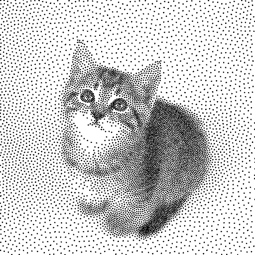
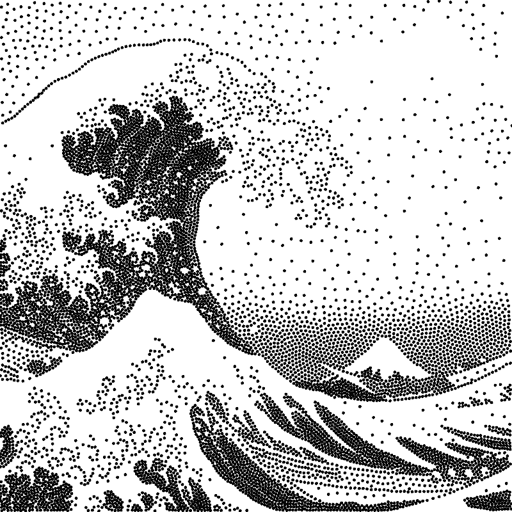

# atoMeow
## Blue noise image stippling in Processing (requires GPU)

Many Twitter friends are talking about sample code, and I think [*Processing*](https://www.processing.org) is probably the best platform to write a demo.  This demo is created for coders who are familiar with this awesome creative coding platform.  You may quickly modify the code to work for video or to stipple your own Procssing drawings by turning them into `PImage` and run the simulation.  This demo code also serves as a reference implementation of my article [_Blue noise sampling using an N-body simulation-based method_](https://link.springer.com/article/10.1007/s00371-017-1382-9).  If you are interested in 2.5D, you may mod the code to achieve what I discussed in this artist friendly [article](https://www.researchgate.net/publication/344852879_25D_Computational_Image_Stippling).

This code has been tested on Processing 3.5.4 (Windows 10 (nVIDIA GPU) and MacOS Big Sur (MBP 2016 with Intel Iris)).

 |  
:---: | :---: 
*Original atoMeow Moving Stipples on Twitter* | *My Fav. Hokusai* 

## QuickStart
Many sim-essential global variables are highlighted and documented, please study the usual `setup()` and `draw()` functions for how the simulation code works.  You may use any `PImage` as *Field* image (Electrostatic field) and feed it to `void updateField(<PImage>)` (line #203) function; it will be automatically resized to fit the size `int simXY;` (line #47).  The maximum number of dots to simulate is determined by `int bufXY;` (line #46), please note that they both shall raise the GPU memory demand.  (I find 8192 points reasonable for most laptops).  The function `void sim(int n);` is designed to run a number of steps before `return` such that you could sub-sample easily the outputs or for creating your image sequence stippling (Yes! Processing Video library reads frames into Processing as `PImage` ? (I recall ...).  I believe you will do your homework!

Have Fun!  If you have never coded with Processing, you are missing something very important !!  Go https://www.processing.org/ (20 Years Anniversary) and you will create your first sketch before you finish your Latte.

## Making-Of Note
I have not used Processing for a long time .... so my know-how is rusty; I was looking for the possibility of using compute shaders (render to multiple tragets) but no luck and no time.  Please enlighten me if there are better ways, my Twitter [`@artixels`](https://twitter.com/artixels).  Anyways, so I actually made a *Dirty Hack* of encoding 2x Half-precision (I am a VFX guy) `float` (per-particle pos(x,y), vel(x,y) and acc(x,y)) to fit into a `color` of Processing.  This allows results to be captured using `.copy()` of `PGraphics` and pipe them down to next shader via a `PImage`.  I am glad the round-tripping was working quickly too, thanks to the awesome Java function I found in [_Stackoverflow_](https://stackoverflow.com/questions/6162651/half-precision-floating-point-in-java) by [_x4u_](https://stackoverflow.com/users/237321/x4u). Another good 16-bit Half `float` [option](https://stackoverflow.com/a/51749430) by [Martijn Courteaux](https://stackoverflow.com/users/155137/martijn-courteaux) for the range 0.0 - 1.0 (no sign) is also very attractive, it should be great for next creative coding project.

Okay! thank you for your interest and love of the atoMeow.

